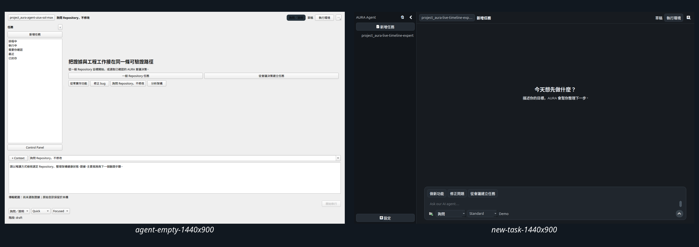

# Codex-Desktop-Inspired Native Agent Workspace Evidence

**Date:** 2026-07-26 (Asia/Taipei)
**Pinned baseline:** `9b54c36064c7869d5b752ba03646ff9ed57cfaa9`
**Soak code checkpoint:** `43eab8361ad22de45a9d98f4ad52a6f8d0a9a9f9`
**Final clean-source regression checkpoint:** `6d2b137c60049cb7e8951882e8b8ace9b2d854b0`
**Status:** `READY WITH EXPLICIT VALIDATION GATES`

## Evidence scope

This packet retains the source-backed visual, performance, reliability, and
audit evidence for the native PyQt6 Agent Workspace redesign. The repository
source, UX design documents, ADRs, and row-level acceptance ledger remain
canonical for implementation and decision detail.

## Visual evidence



*The comparison shows the baseline workflow-first screen beside the implemented intent-first native workspace, making the reduction in persistent controls and empty chrome directly reviewable.*

The packet contains:

- four baseline empty-state captures;
- nine implemented states at 1024×768, 1280×820, 1440×900, and 1920×1080;
- 36 final state/viewport captures in total;
- an all-state 1440×900 contact sheet;
- a four-resolution new-task contact sheet;
- one combined baseline-versus-redesign comparison.

Implemented states:

1. no repository;
2. new task;
3. evidence attached;
4. running;
5. waiting approval;
6. completed with Diff inspector;
7. recovery;
8. recording restriction;
9. category-based Settings.

These images are deterministic native Qt evidence. They support layout and
state review and do not substitute for assistive-technology or human-usability
evaluation.

## Measured validation

| Gate | Result |
| --- | --- |
| Final full regression | 520 tests in 32.393s, `OK` |
| Native workspace soak | 50 tasks in 7.328s, `PASS` |
| Approval cycles | 10 |
| Stop cycles | 10 |
| Provider failure/reconnect cycles | 30 |
| Recovery cycles | 10 |
| Restart work items | 50 retained |
| Thread switch | 12.348ms |
| Large event projection | 0.488ms |
| 50 MiB log preview | 0.028ms; 65,536 bytes loaded |
| Content-free audit | 1,223 events; integrity `PASS` |
| Responsive captures | 36/36 at declared geometries |

The soak is deterministic native integration evidence. The preserved real
Codex target-runtime evidence remains in
[`../2026-07-26-workspace-write-thread-start-fix/`](../2026-07-26-workspace-write-thread-start-fix/).

## Audit evidence

The soak emitted one content-free hash chain:

- session:
  `agent-workspace-soak-1785018453486833205`;
- first event:
  `agent.provider_started`, sequence 1,
  hash `ea53f5781646d23bc8de71c3641ba69f4d4f8038d2b2e5776d25c79eeb1b8039`;
- final event:
  `app.session_ended`, sequence 1223,
  hash `35a3720fb48c712e465a4cdaa159b499dbd1c625a1d3dda26b5a1ea5f597c6fb`;
- analysis:
  `audit_integrity_pass: true`.

The JSONL stores state/category metadata and excludes task text, repository
content, credentials, raw audio, and personal contact data.

The earlier workspace-write `thread/start` incident and its stable-contract
root fix remain fully documented in
[`AUDIT-2026-07-26-AURA-AGENT-THREAD-START-001`](../../../docs/audit-events/2026-07-26-agent-workspace-thread-start-compatibility/audit-event.md).

## Acceptance interpretation

| Classification | Count |
| --- | ---: |
| `CONFIRMED` | 90 |
| `PARTIALLY VERIFIED` | 3 |
| `NOT VERIFIED` | 1 |
| Total | 94 |

The open validation layers are:

- five-participant task-based usability and five-second comprehension study;
- assistive-technology field review;
- complete background execution for every remaining legacy Git, SQLite,
  report, media, and provider UI action.

See
[`11-acceptance-status.md`](../../../docs/agent-workspace/ux-redesign/11-acceptance-status.md)
and
[`12-usability-evaluation-results.md`](../../../docs/agent-workspace/ux-redesign/12-usability-evaluation-results.md).

## Integrity

[`checksums.sha256`](checksums.sha256) binds the baseline images, final images,
comparison image, soak report, and content-free audit JSONL. Run:

```bash
cd artifacts/agent-workspace/2026-07-26-codex-desktop-inspired-uiux
sha256sum --check checksums.sha256
```

[`validation-report.md`](validation-report.md) records the executed commands,
results, classifications, and scope. [`missing-evidence.md`](missing-evidence.md)
keeps the remaining validation paths explicit.
