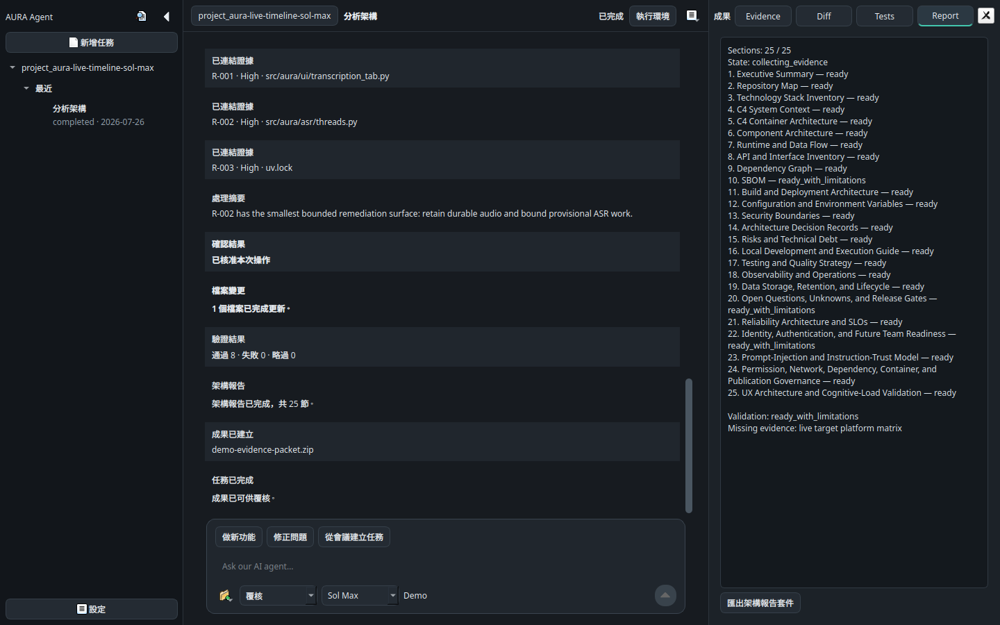

# Agent Workspace Conversation Continuity Evidence

## Result

Status: `LIVE_MINIMUM_COMPLETED`

The current WorkItem retains prior Prompt and response rows across completed
AgentRuns. A continuation resumes the same Codex provider thread, and
**新增任務** clears the visible conversation for the next WorkItem. Codex
thinking and execution status remains inside the main composer.

## Source observation

*The supplied source image shows the unparented indeterminate progress widget presented as a separate top-level `aura` window.*

## Accepted implementation

*The accepted active state keeps phase, progress, approval, stop, and follow-up controls in the main Agent Workspace.*

*The accepted terminal state retains one sidebar task while the shared timeline contains both Run projections.*

## Runtime validity

- Live Codex: `valid_target_runtime`
- Provider: Codex app-server over stdio
- Account: signed in
- Model: `gpt-5.6-sol`
- Effort: `low`
- Real turns: 2
- Same provider thread: `true`
- Expected replies observed: 2/2
- Turn 1: 6.151 seconds and 35 events
- Turn 2: 4.421 seconds and 37 events
- Total: 10.833 seconds
- Tracked checkout unchanged: `true`
- Process tree clean after shutdown: `true`
- Credential values captured: `false`
- Raw audio transferred: `false`

## Validation

- Direct behavior checks: 3/3 pass.
- Focused Agent suites: 98/98 pass.
- Full regression: 597/597 pass.
- Machine audit: 141 events, 0 read issues, 0 integrity issues.
- Qt capture: 1440×900 source and accepted states inspected.

## Files

- `before/observed-detached-aura-window.png`
- `screenshots/01-inline-codex-status.png`
- `screenshots/02-two-turn-continuity.png`
- `live-two-turn/live-run-summary.json`
- `live-two-turn/event-trace.jsonl`
- `live-two-turn/error-log.jsonl`
- `live-two-turn/request-summary.jsonl`
- `live-two-turn/runtime-validity-report.md`
- `live-two-turn/latency-report.md`
- `live-two-turn/failure-analysis.md`
- `audit/audit-2026-07-26.jsonl`
- `checksums.sha256`

## Decision

- Production default: Live with same-WorkItem continuation.
- Operational fallback: deterministic Demo through the same timeline.
- New conversation boundary: **新增任務**.
- Next validation: screen-reader phase-announcement timing and named
  Windows/macOS target hosts.

