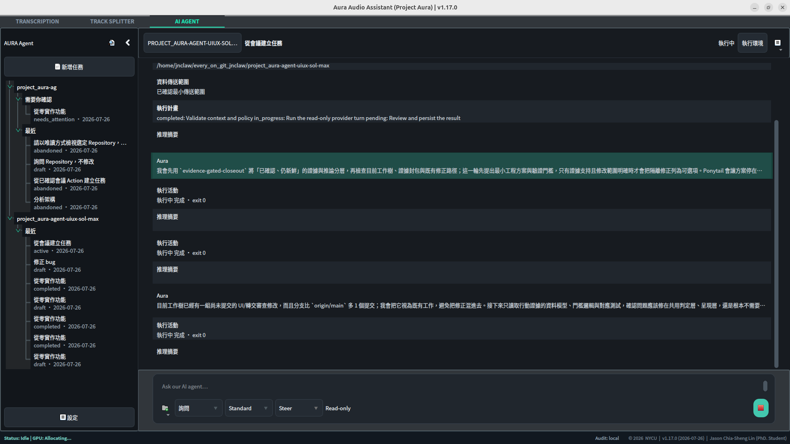
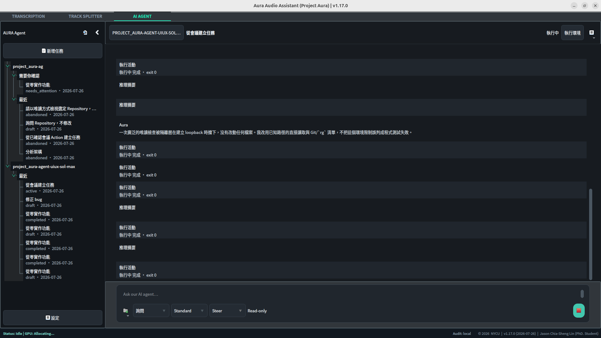
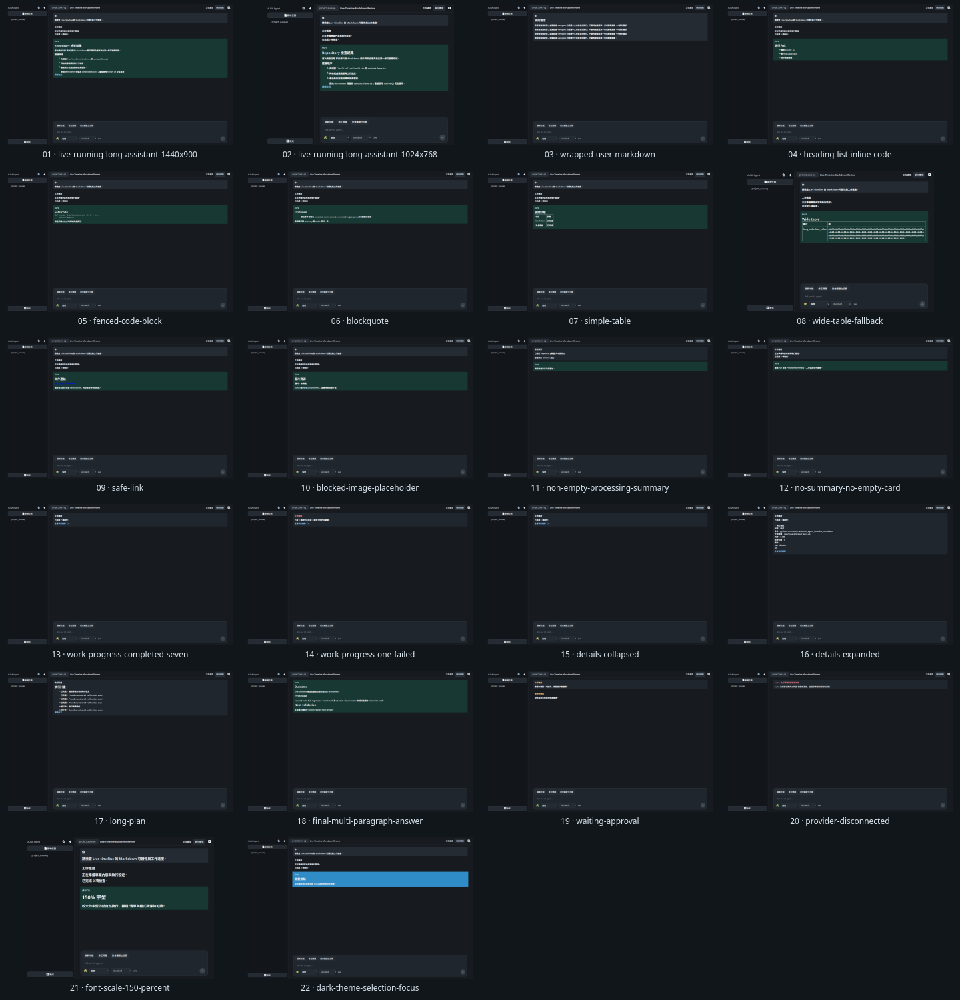

# Live Timeline Markdown and Activity Digest Evidence

Status: **VALIDATED ON UBUNTU 24.04**

This packet connects the user-observed Live timeline issue to the native Qt
implementation, deterministic visual states, performance measurements,
regression evidence, and content-free audit lineage.

## Source identity

| Field | Value |
| --- | --- |
| Feature source commit | `3dcf465cf5650af206d3b0c8ec6665f4bdd68266` |
| Goal prompt SHA-256 | `674be6e35e2c3272fdcd40c63b1866c4d734f4195f6877fb49d07262b335a5fc` |
| Visual states | `22` |
| Blank projected items | `0` |
| Focused validation | `82 tests in 5.309s — OK` |
| Full repository regression | `588 tests in 40.057s — OK` |
| Performance gate | `PASS`; maximum measured GUI-thread stall `55.351 ms` |

## Before

*Figure 1. The first user-provided Live run shows readable event transport but compresses long assistant content, surfaces raw provider vocabulary, and allocates cards to empty summaries.*

*Figure 2. The second user-provided Live run confirms that the issue repeats as the event stream grows and obscures the operator's current task and final result.*

## After

*Figure 3. The final native Qt matrix covers two viewports, Markdown structures, safe links and resources, summary reconciliation, grouped progress, details, terminal states, 150% font scaling, selection, and focus.*

The per-state PNG and JSON pairs are under [`after/`](after/). Each JSON file
records state identity, geometry, format, item count, blank count, body digest,
and image digest. [`after/manifest.json`](after/manifest.json) binds the matrix
to source commit `3dcf465cf5650af206d3b0c8ec6665f4bdd68266`, and
[`after/checksums.sha256`](after/checksums.sha256) verifies the images.

## Performance and validation

- [`performance/performance-benchmark.md`](performance/performance-benchmark.md)
  records the native model/view, Markdown, streaming, lifecycle, resize,
  scaling, long-response, memory, cache, and GUI-stall measurements.
- [`validation/validation-summary.md`](validation/validation-summary.md)
  records the focused and full test layers, static checks, visual review, and
  evidence boundaries.
- [`after/visual-review.md`](after/visual-review.md) records the 22-state
  expert review and the separate target-host assistive-technology gate.
- [`before/manifest.json`](before/manifest.json) and
  [`before/checksums.sha256`](before/checksums.sha256) preserve the
  user-provided baseline identities.

## Evidence boundary

The screenshots use the real native widgets with sanitized canonical-event
fixtures; they activate no external provider. The provider schema paths are
covered by focused and subprocess integration tests. Ubuntu 24.04 automated
and offscreen evidence is confirmed. Target-host screen-reader field review
and human five-second task study remain explicit next validation layers.
