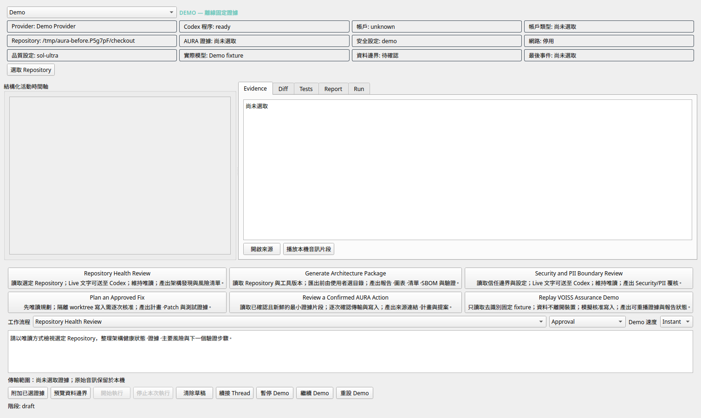
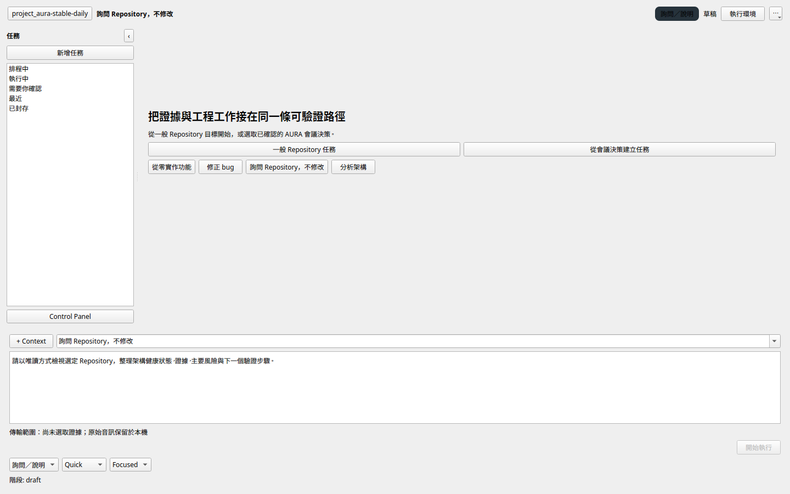
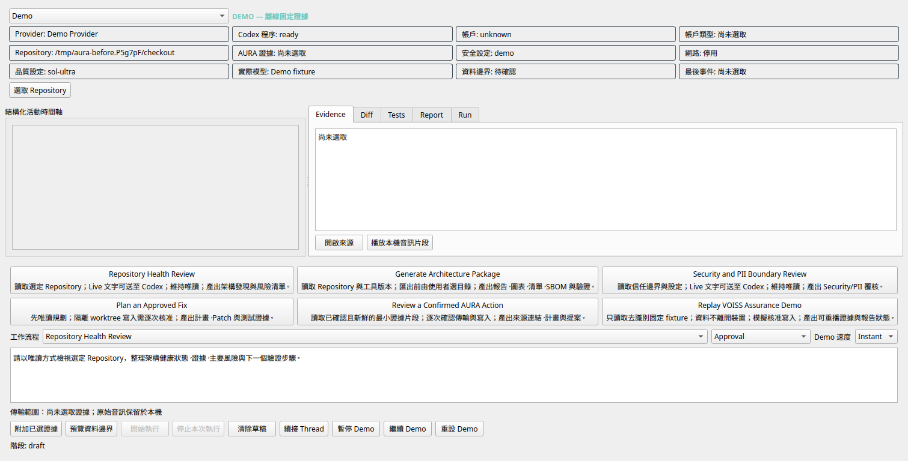
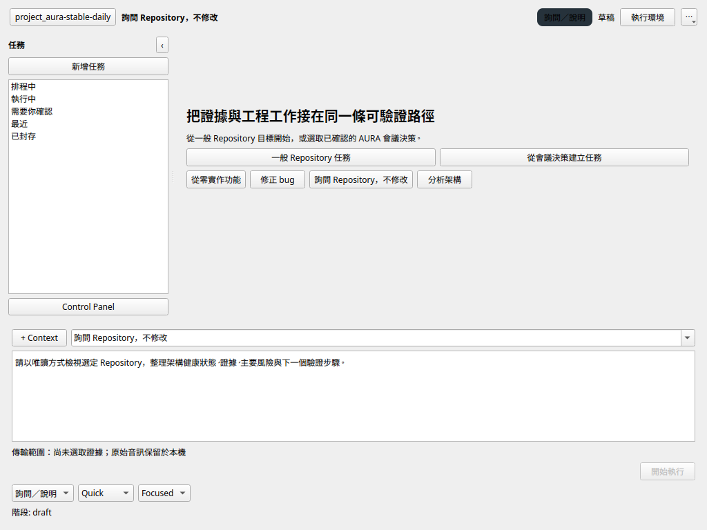

# Agent Workspace Visual Evidence

These screenshots were captured from the real native PyQt6 widget with the
Fusion style and offscreen Qt platform. The before images use baseline commit
`b19c00d3703a2aafd5316407acb8e67aecd42929`; the after images use the stable
daily-use implementation.

*The baseline exposes provider, account, repository, safety, model, evidence,
inspector, workflow, and Demo controls simultaneously; its 1,510-pixel minimum
width exceeds the requested 1,440-pixel viewport.*

*The stable workspace centers the task thread and composer, retains two primary
task paths and four suggestions, and moves environment and control detail into
one-click secondary surfaces.*

*The baseline remains 1,510 pixels wide at the smaller requested viewport,
making the permanent control matrix the dominant interaction.*

*The stable workspace fits the requested viewport while preserving the task
rail, primary composer, operating-mode selectors, and one-click environment
access.*

## Review Result

- Task-first hierarchy: confirmed.
- Empty-state limit of two primary paths and four suggestions: confirmed.
- Permanent provider/account/status matrix removed from the main surface:
  confirmed.
- Permanent Demo controls moved to the Control Panel: confirmed.
- Empty inspector removed: confirmed.
- Common-size fit: confirmed at 1,440 × 900 and 1,024 × 768 for the stable
  implementation.
- Traditional Chinese service wording and readable control labels: confirmed.
- Final human preference review remains available as the next stewardship
  layer.
