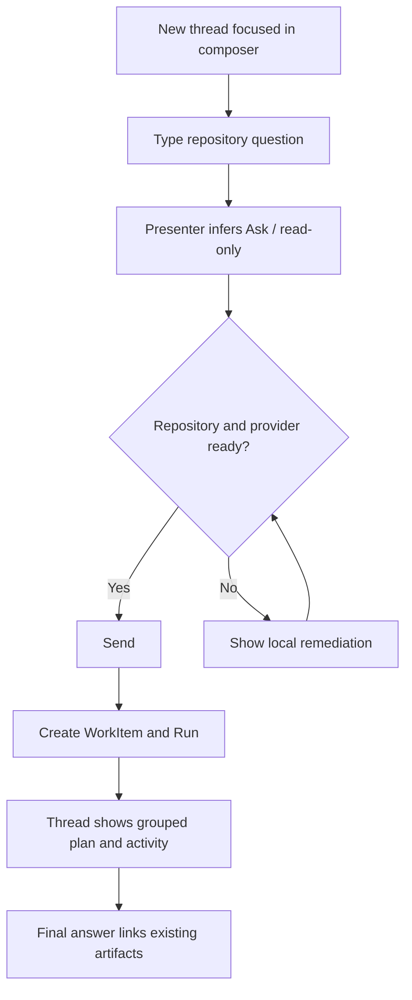
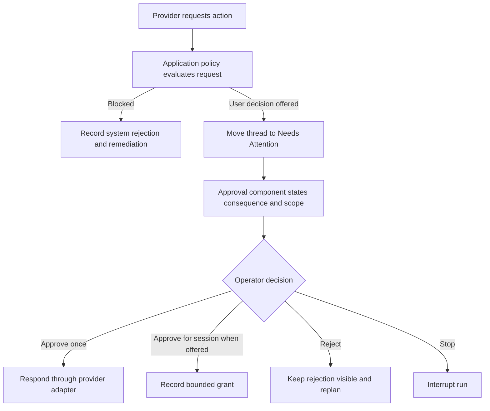

# Agent Workspace User Flows

**Status:** CRITICAL STATES COVERED

## Shared start contract

1. AURA opens the Agent tab.
2. The last allowed repository is selected when available.
3. A new or existing thread is visible.
4. A new thread places keyboard focus in the composer.
5. The operator types intent before choosing implementation detail.
6. The presenter exposes an actionable send state or a local disabled reason.

Audit events record tab entry, repository selection, context selection,
transfer preview/confirmation, run start, approvals, artifacts, recovery, and
provider outcomes through the existing sanitized audit seam.

## F-01 — General repository question

The operator does not select General versus Evidence-Backed or a workflow
before typing.

## F-02 — Feature or bug implementation

1. Type the objective or use `/feature` or `/bug`.
2. The presenter infers Implement as a requested access scope.
3. The composer displays an Implement chip and explains isolated-worktree
   activation.
4. Send opens the existing policy confirmation at the consequential boundary.
5. The application service creates the WorkItem, queued AgentRun, and isolated
   worktree through existing services.
6. The thread groups plan, commands, file changes, and validation.
7. Existing Diff and Tests artifacts activate inspector affordances.
8. Publication remains absent until Publish is explicitly selected and all
   gates pass.

Workflow inference suggests intent; policy remains authoritative and cannot be
escalated by text alone.

## F-03 — Attach confirmed meeting evidence

1. Begin in the same composer.
2. Choose **加入會議證據**.
3. Evidence Context Picker lists eligible confirmed and supported actions first.
4. Preview source segments and optionally play the local audio span.
5. Attach the action; no provider transfer occurs.
6. The composer shows a removable evidence chip and automatically identifies
   the thread as evidence-backed.
7. Sending initiates freshness validation and exact transfer preview.
8. Confirm the minimum transmitted text.
9. Create the WorkItem/Run with the evidence digest and source linkage.
10. Evidence remains available in the contextual inspector.

Changing task text, evidence, repository, model identity, or transfer content
invalidates prior confirmation.

## F-04 — Waiting approval

Protocol IDs and raw request detail are secondary. High-risk detail begins
expanded. Focus enters the decision group and returns to the thread afterward.

## F-05 — Review diff and tests

1. Completion summary announces only artifacts that exist.
2. Choose the Diff or Tests action.
3. Inspector opens within two actions.
4. Diff view presents file list, status, and patch through a dedicated model.
5. Tests view presents command, outcome, counts, duration, and evidence class.
6. Closing the inspector returns to the completion summary.

## F-06 — Return to a recent task

1. Select repository if needed.
2. Select a pinned, attention, queued, or recent thread.
3. The application service loads thread summary, draft, and latest run
   projection.
4. The timeline model lazy-loads/coalesces events.
5. The composer restores the per-thread draft.

The path requires no more than repository selection plus thread selection.

## F-07 — Inspect environment

1. Choose the compact environment/status action or use the command palette.
2. Open one grouped environment surface.
3. Review repository/worktree, provider/account, model/effort/budget,
   access/grants, recording/resources, diagnostics/storage.
4. Route to settings only when a value needs modification.

## F-08 — Recording or live ASR begins

1. MainWindow supplies the resource snapshot.
2. A slim banner states the current available path.
3. Ask/read-only tasks remain eligible within resource policy.
4. Heavy or mutating requests are queued with the exact wait reason.
5. An active heavy run follows the existing interruption contract.
6. No task automatically restarts when recording ends; the operator sees the
   queued/recovery action.

## F-09 — Provider/login/model failure

1. The provider adapter emits a normalized failure.
2. The presenter maps the error class to a remediation state.
3. The thread keeps prior events and shows:
   - what remains preserved;
   - the next action, such as reconnect, sign in, select a supported profile,
     inspect diagnostics, or retry;
   - the relevant environment shortcut.
4. The run ends in the durable failed/attention state.
5. Audit and diagnostics retain sanitized protocol evidence.

The historical `JsonRpcRequestFailed` at `thread/start` is represented as a
provider compatibility/remediation case and remains covered by provider
contract regression tests.

## F-10 — Recovery after abnormal interruption

1. Startup reconciliation discovers incomplete run/catalog records.
2. The affected thread appears under Needs Attention.
3. A Recovery Card presents preserved run, worktree, provider thread, pending
   approval, and side-effect evidence.
4. **Inspect** opens inert history.
5. **Resume** performs a fresh preflight; mutating work requires renewed
   confirmation.
6. **Abandon** ends the run while preserving evidence and worktree.

## F-11 — Publish contextual result

1. A completed implementation with passing required validation exposes
   **準備發布**.
2. Publish preflight shows branch, base, remote, validation, evidence freshness,
   and secret-scan status.
3. The operator explicitly activates local commit, branch push, or pull
   request.
4. Existing `PublicationManager` enforces agent branch, allowed remote,
   non-force, validation, and evidence gates.
5. The inspector records actual commit, diff digest, branch, remote, and PR URL.

## F-12 — True application exit

1. The operator chooses actual exit.
2. MainWindow invokes Agent shutdown.
3. Active turn receives interruption.
4. Provider process stops.
5. Draft and recovery reconciliation persist.
6. Catalog closes after durable state is written.

Hide-to-tray remains distinct from true exit.

## Flow acceptance map

| Flow | Acceptance |
| --- | --- |
| F-01 | UX-001–007, UX-017–020, UX-024–025 |
| F-02 | UX-025–027, UX-035, REG-005 |
| F-03 | UX-004, UX-021, UX-041–045, UX-052 |
| F-04 | UX-046–049 |
| F-05 | UX-036–040 |
| F-06 | UX-008–016 |
| F-07 | UX-050–051 |
| F-08 | UX-053–057 |
| F-09 | UX-034, REG-002–003, REG-008 |
| F-10 | UX-059–060 |
| F-11 | REG-005–009 |
| F-12 | UX-058 |
